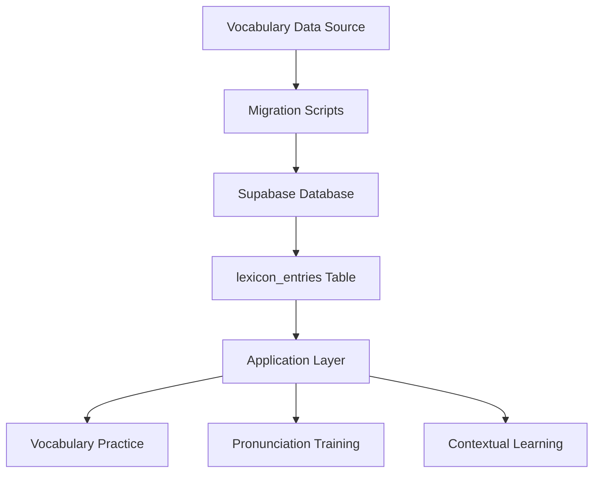

# Design Document: Comprehensive Vocabulary Data

## Overview

This design addresses the enhancement of the existing vocabulary database by populating comprehensive linguistic information for 1000 General Service List (GSL) words. The current lexicon_entries table has the schema in place but contains only minimal data (headword, CEFR level, POS, entry_type). This feature will populate the remaining fields: IPA pronunciation, simple and teacher definitions, usage notes, examples, collocations, patterns, register, and variety information.

The implementation uses a batched migration strategy to maintain code reviewability and allow incremental deployment. Each migration batch will update 100-200 words using UPDATE statements, organized by CEFR level (A0 first, then A1).

### Design Goals

- Transform the lexicon from a simple word list into a rich pedagogical resource
- Support pronunciation training through IPA transcriptions
- Provide context-appropriate definitions for both learners and teachers
- Enable natural language production through collocations and patterns
- Prioritize professional and business English contexts for Brazilian learners
- Maintain data consistency and quality through validation
- Enable incremental rollout and testing through batched migrations

## Architecture

### Data Flow



### Migration Strategy

The vocabulary enhancement follows a batched migration approach:

1. **Batch Organization**: Words grouped into migrations of 100-200 entries each
2. **CEFR Ordering**: A0 words processed first, then A1 words
3. **Sequential Timestamps**: Migration files use sequential timestamps for proper ordering
4. **Idempotent Updates**: UPDATE statements with WHERE clauses on headword ensure safe re-running
5. **Validation Queries**: Separate validation scripts verify data completeness and quality

### Database Schema

The existing `lexicon_entries` table already contains all necessary fields:

```sql
CREATE TABLE public.lexicon_entries (
  id UUID PRIMARY KEY DEFAULT gen_random_uuid(),
  headword TEXT NOT NULL,
  entry_type TEXT NOT NULL DEFAULT 'lemma',
  pos TEXT,
  cefr_receptive TEXT,
  cefr_productive TEXT,
  ipa TEXT,                      -- To be populated
  definition_simple TEXT,        -- To be populated
  definition_teacher TEXT,       -- To be populated
  usage_notes TEXT,              -- To be populated
  register TEXT,                 -- To be populated
  variety TEXT,                  -- To be populated
  examples JSONB DEFAULT '[]',   -- To be populated
  collocations JSONB DEFAULT '[]', -- To be populated
  patterns JSONB DEFAULT '[]',   -- To be populated
  frequency_band TEXT,
  is_published BOOLEAN NOT NULL DEFAULT false,
  created_at TIMESTAMPTZ NOT NULL DEFAULT now(),
  updated_at TIMESTAMPTZ NOT NULL DEFAULT now()
);
```

## Components and Interfaces

### Migration Scripts

Each migration script follows this structure:

```sql
-- Migration: Enhance GSL Vocabulary - Batch N (Words X-Y)
-- Description: Add comprehensive linguistic data for A0/A1 words

UPDATE lexicon_entries
SET
  ipa = '[IPA transcription]',
  definition_simple = '[Simple definition using A1-A2 vocabulary]',
  definition_teacher = '[Detailed linguistic definition]',
  usage_notes = '[Professional context usage guidance]',
  register = '[formal|neutral|informal]',
  variety = '[US|UK|international]',
  examples = '["Example 1", "Example 2", "Example 3"]'::jsonb,
  collocations = '["collocation 1", "collocation 2"]'::jsonb,
  patterns = '["pattern 1", "pattern 2"]'::jsonb,
  updated_at = now()
WHERE headword = '[word]';
```

### Validation Queries

Validation scripts check data quality:

```sql
-- Check for missing required fields
SELECT headword, cefr_receptive
FROM lexicon_entries
WHERE is_published = true
  AND (ipa IS NULL OR ipa = ''
       OR definition_simple IS NULL OR definition_simple = ''
       OR examples IS NULL OR jsonb_array_length(examples) = 0);

-- Verify register values
SELECT headword, register
FROM lexicon_entries
WHERE is_published = true
  AND register NOT IN ('formal', 'neutral', 'informal');

-- Verify variety values
SELECT headword, variety
FROM lexicon_entries
WHERE is_published = true
  AND variety NOT IN ('US', 'UK', 'international');
```

### Batch Tracking Query

Monitor completion status across batches:

```sql
-- Count populated vs unpopulated entries
SELECT 
  cefr_receptive,
  COUNT(*) as total,
  COUNT(ipa) as with_ipa,
  COUNT(definition_simple) as with_definition,
  COUNT(CASE WHEN jsonb_array_length(examples) > 0 THEN 1 END) as with_examples
FROM lexicon_entries
WHERE is_published = true
GROUP BY cefr_receptive
ORDER BY cefr_receptive;
```

## Data Models

### Lexicon Entry Enhancement

Each vocabulary entry will be enhanced with the following data:

#### IPA Pronunciation
- **Format**: Standard IPA notation without slashes or brackets
- **Example**: `ˈwɜːkɪŋ` for "working"
- **Variety Handling**: Pronunciation matches the variety field (US/UK/international)
- **Multiple Pronunciations**: Store the most common international pronunciation

#### Simple Definition
- **Audience**: Language learners (A1-B1 level)
- **Vocabulary**: Uses A1-A2 level words only
- **Length**: One to two sentences maximum
- **Focus**: Most common meaning of the word
- **Example**: "work" → "to do a job to earn money"

#### Teacher Definition
- **Audience**: Teachers and advanced learners
- **Content**: Semantic range, register information, polysemy notes
- **Grammatical Behavior**: References relevant grammatical patterns
- **Example**: "work" → "verb: to perform labor or duties in exchange for payment; can be transitive (work something) or intransitive (work at/in/for); neutral register; used across all professional contexts"

#### Usage Notes
- **Context**: Professional and business English priority
- **Restrictions**: Documents usage limitations when applicable
- **Brazilian Learners**: Notes common errors made by Portuguese speakers
- **Example**: "work" → "In professional contexts, prefer 'I work at [company]' over 'I work in [company]' when referring to employment. Brazilian learners often confuse with 'job' (countable noun)."

#### Register and Variety
- **Register Values**: 'formal', 'neutral', or 'informal'
- **Variety Values**: 'US', 'UK', or 'international'
- **Defaults**: 'neutral' register and 'international' variety when no specific variant preferred
- **Example**: "work" → register: 'neutral', variety: 'international'

#### Examples (JSONB Array)
- **Count**: 2-4 examples per word
- **Context**: Professional and workplace contexts prioritized
- **Grammar Level**: A1-B1 level grammar structures
- **Usage**: Demonstrates most common usage patterns
- **Format**: `["Example 1", "Example 2", "Example 3"]`
- **Example**: `["I work in an office.", "She works from home.", "We work together on projects."]`

#### Collocations (JSONB Array)
- **Count**: 2-5 high-frequency collocations (when applicable)
- **Priority**: Professional English collocations
- **Empty Array**: When word has no notable collocations
- **Format**: `["collocation 1", "collocation 2"]`
- **Example**: `["hard work", "work experience", "work environment", "team work"]`

#### Patterns (JSONB Array)
- **Count**: 1-3 common grammatical patterns (when applicable)
- **Notation**: Uses format like "verb + to-infinitive" or "adjective + preposition + noun"
- **Priority**: Patterns that Brazilian learners commonly struggle with
- **Empty Array**: When word has no specific patterns
- **Format**: `["pattern 1", "pattern 2"]`
- **Example**: `["work + at/in/for + place", "work + on + project", "work + with + person"]`

### Migration Batch Structure

Each migration batch contains:

- **Batch Number**: Sequential identifier (Batch 1, Batch 2, etc.)
- **Word Range**: Descriptive range (e.g., "A0 Pronouns and Basic Verbs")
- **Word Count**: 100-200 words per batch
- **CEFR Level**: Grouped by level (A0 batches first, then A1)
- **Timestamp**: Sequential timestamp for proper migration ordering
- **Naming Convention**: `YYYYMMDDHHMMSS_enhance_gsl_vocabulary_batch_N.sql`

### Example Migration Batch

```sql
-- Migration: Enhance GSL Vocabulary - Batch 1 (A0 Pronouns and Basic Verbs)
-- Description: Add comprehensive linguistic data for first 150 A0 words
-- Words: I, you, he, she, it, we, they, be, have, do, go, come, get, make, take...

UPDATE lexicon_entries
SET
  ipa = 'aɪ',
  definition_simple = 'the person who is speaking or writing',
  definition_teacher = 'pronoun: first person singular subject pronoun; refers to the speaker/writer; neutral register; used in all contexts',
  usage_notes = 'Always capitalized in English. Used in both formal and informal contexts.',
  register = 'neutral',
  variety = 'international',
  examples = '["I am a teacher.", "I work in São Paulo.", "I like coffee."]'::jsonb,
  collocations = '[]'::jsonb,
  patterns = '[]'::jsonb,
  updated_at = now()
WHERE headword = 'I';

-- Additional UPDATE statements for remaining words in batch...
```


## Correctness Properties

A property is a characteristic or behavior that should hold true across all valid executions of a system—essentially, a formal statement about what the system should do. Properties serve as the bridge between human-readable specifications and machine-verifiable correctness guarantees.

### Property 1: Required Field Completeness

For all published GSL vocabulary entries in the lexicon_entries table, the fields ipa, definition_simple, definition_teacher, usage_notes, register, and variety must contain non-null, non-empty values.

**Validates: Requirements 1.1, 2.1, 3.1, 4.1, 5.1, 5.3**

### Property 2: IPA Format Validation

For all vocabulary entries with IPA transcriptions, the ipa field must not contain the characters '/', '[', or ']'.

**Validates: Requirements 1.3**

### Property 3: Simple Definition Length Constraint

For all vocabulary entries, the definition_simple field must contain between 1 and 2 sentences (inclusive).

**Validates: Requirements 2.3**

### Property 4: Enumerated Field Validation

For all vocabulary entries, the register field must contain exactly one of the values 'formal', 'neutral', or 'informal', and the variety field must contain exactly one of the values 'US', 'UK', or 'international'.

**Validates: Requirements 5.2, 5.4**

### Property 5: JSONB Field Structure Validation

For all vocabulary entries, the examples, collocations, and patterns fields must be valid JSONB arrays where all elements are strings.

**Validates: Requirements 6.1, 7.1, 8.1, 10.3**

### Property 6: Examples Cardinality Constraint

For all vocabulary entries, the examples array must contain between 2 and 4 elements (inclusive).

**Validates: Requirements 6.2**

### Property 7: Collocations Cardinality Constraint

For all vocabulary entries where the collocations array is non-empty, it must contain between 2 and 5 elements (inclusive).

**Validates: Requirements 7.2**

### Property 8: Patterns Cardinality Constraint

For all vocabulary entries where the patterns array is non-empty, it must contain between 1 and 3 elements (inclusive).

**Validates: Requirements 8.2**

### Property 9: Migration Idempotency

For any migration batch, executing the migration multiple times produces the same final database state as executing it once.

**Validates: Requirements 9.5, 12.5**

### Property 10: Field Preservation During Updates

For any vocabulary entry update operation, the fields id, headword, pos, cefr_receptive, cefr_productive, entry_type, and is_published must retain their original values before and after the update.

**Validates: Requirements 10.1**

### Property 11: Timestamp Update on Modification

For any vocabulary entry update operation that modifies linguistic data fields, the updated_at timestamp must be greater than its value before the update.

**Validates: Requirements 10.2**

### Property 12: Special Character Preservation

For any vocabulary entry with special characters (quotes, apostrophes, accented characters, etc.) in text fields, inserting the entry and then retrieving it must return the exact same text content (round-trip property).

**Validates: Requirements 10.4**

### Property 13: Batch Migration Independence

For any migration batch N (where N > 1), executing batch N must succeed regardless of whether batch N-1 has been executed, as long as the initial vocabulary seed migration has been applied.

**Validates: Requirements 12.1**

### Property 14: Rollback Isolation

For any migration batch that is rolled back, vocabulary entries modified by other batches must remain unchanged and retain their enhanced data.

**Validates: Requirements 12.3**

## Error Handling

### Migration Execution Errors

**Non-Existent Headword**: When an UPDATE statement attempts to modify a headword that doesn't exist in the database:
- The migration should continue processing remaining UPDATE statements
- A warning should be logged indicating which headword was not found
- The migration should not fail or rollback
- This allows for flexibility if the seed data changes

**Invalid JSON Data**: When JSONB field data is malformed:
- PostgreSQL will reject the UPDATE with a JSON parsing error
- The migration should fail and rollback to prevent partial data corruption
- Error message should clearly indicate which word and field caused the issue
- Developer must fix the JSON syntax and re-run the migration

**Constraint Violations**: When data violates database constraints:
- PostgreSQL will reject the UPDATE with a constraint violation error
- The migration should fail and rollback
- Error message should indicate which constraint was violated
- Developer must fix the data and re-run the migration

### Data Validation Errors

**Missing Required Fields**: Validation queries identify entries with missing data:
- Queries return list of affected headwords and missing fields
- No automatic correction - requires manual data entry
- Entries remain in database but flagged as incomplete

**Invalid Enumerated Values**: Validation queries identify invalid register/variety values:
- Queries return list of affected headwords and invalid values
- Requires manual correction through UPDATE statements
- Should be caught during migration development, not production

**Cardinality Violations**: Validation queries identify arrays with incorrect element counts:
- Queries return list of affected headwords and current counts
- Requires manual correction through UPDATE statements
- Should be caught during migration development, not production

### Rollback Procedures

**Individual Batch Rollback**: To rollback a specific migration batch:
```sql
-- Revert enhanced fields to NULL/empty for specific words
UPDATE lexicon_entries
SET
  ipa = NULL,
  definition_simple = NULL,
  definition_teacher = NULL,
  usage_notes = NULL,
  register = NULL,
  variety = NULL,
  examples = '[]'::jsonb,
  collocations = '[]'::jsonb,
  patterns = '[]'::jsonb,
  updated_at = now()
WHERE headword IN ('word1', 'word2', 'word3', ...);
```

**Full Rollback**: To rollback all vocabulary enhancements:
```sql
-- Revert all enhanced fields for all GSL words
UPDATE lexicon_entries
SET
  ipa = NULL,
  definition_simple = NULL,
  definition_teacher = NULL,
  usage_notes = NULL,
  register = NULL,
  variety = NULL,
  examples = '[]'::jsonb,
  collocations = '[]'::jsonb,
  patterns = '[]'::jsonb,
  updated_at = now()
WHERE headword IN (
  SELECT headword FROM lexicon_entries 
  WHERE cefr_receptive IN ('A0', 'A1') 
  AND is_published = true
);
```

## Testing Strategy

### Dual Testing Approach

This feature requires both unit testing and property-based testing to ensure comprehensive coverage:

**Unit Tests**: Verify specific examples, edge cases, and error conditions
- Test migration script execution with sample data
- Test validation query correctness
- Test rollback procedures
- Test error handling for malformed JSON
- Test error handling for non-existent headwords
- Test specific examples of special character handling

**Property-Based Tests**: Verify universal properties across all inputs
- Test that all required fields are populated (Property 1)
- Test IPA format validation (Property 2)
- Test definition length constraints (Property 3)
- Test enumerated field validation (Property 4)
- Test JSONB structure validation (Property 5)
- Test cardinality constraints (Properties 6, 7, 8)
- Test migration idempotency (Property 9)
- Test field preservation (Property 10)
- Test timestamp updates (Property 11)
- Test special character round-trip (Property 12)
- Test batch independence (Property 13)
- Test rollback isolation (Property 14)

### Property-Based Testing Configuration

**Testing Library**: Use pgTAP for PostgreSQL property-based testing, or a language-specific PBT library (e.g., Hypothesis for Python, fast-check for TypeScript) for application-level tests.

**Test Iterations**: Each property test must run a minimum of 100 iterations to ensure comprehensive coverage through randomization.

**Test Tagging**: Each property-based test must include a comment tag referencing the design document property:
```sql
-- Feature: comprehensive-vocabulary-data, Property 1: Required Field Completeness
-- Feature: comprehensive-vocabulary-data, Property 2: IPA Format Validation
```

**Test Data Generation**: Property tests should generate:
- Random vocabulary entries with various field combinations
- Random text with special characters (quotes, apostrophes, accents, emoji)
- Random JSONB arrays with varying lengths
- Random register and variety values (both valid and invalid)
- Random IPA strings (both valid and invalid formats)

### Unit Testing Focus

Unit tests should focus on:
- **Migration Execution**: Test that migration scripts execute successfully with sample data
- **Validation Queries**: Test that validation queries correctly identify data quality issues
- **Edge Cases**: Test boundary conditions (empty strings, very long text, maximum array lengths)
- **Error Conditions**: Test handling of malformed JSON, non-existent headwords, constraint violations
- **Rollback Procedures**: Test that rollback scripts correctly revert data changes
- **Integration**: Test that enhanced vocabulary data is correctly retrieved by application layer

### Testing Workflow

1. **Development Phase**: Run unit tests during migration script development
2. **Pre-Deployment**: Run property-based tests on staging database with full dataset
3. **Post-Deployment**: Run validation queries to verify data completeness and quality
4. **Continuous Monitoring**: Periodically run validation queries in production to detect data drift

### Example Property Test (Pseudocode)

```python
# Feature: comprehensive-vocabulary-data, Property 1: Required Field Completeness
@property_test(iterations=100)
def test_required_fields_populated():
    # Generate random published GSL entry
    entry = generate_random_gsl_entry(is_published=True)
    
    # Insert into database
    insert_entry(entry)
    
    # Retrieve from database
    retrieved = get_entry_by_headword(entry.headword)
    
    # Assert all required fields are non-null and non-empty
    assert retrieved.ipa is not None and retrieved.ipa != ""
    assert retrieved.definition_simple is not None and retrieved.definition_simple != ""
    assert retrieved.definition_teacher is not None and retrieved.definition_teacher != ""
    assert retrieved.usage_notes is not None and retrieved.usage_notes != ""
    assert retrieved.register is not None and retrieved.register != ""
    assert retrieved.variety is not None and retrieved.variety != ""
```

### Example Unit Test (Pseudocode)

```python
def test_migration_handles_special_characters():
    # Test specific example with special characters
    entry_data = {
        'headword': 'café',
        'definition_simple': 'A place where you drink coffee and eat food.',
        'examples': ['Let\'s meet at the café.', 'She works in a café.']
    }
    
    # Execute migration with this data
    execute_migration(entry_data)
    
    # Retrieve and verify
    retrieved = get_entry_by_headword('café')
    assert retrieved.headword == 'café'
    assert 'Let\'s' in retrieved.examples[0]
```
