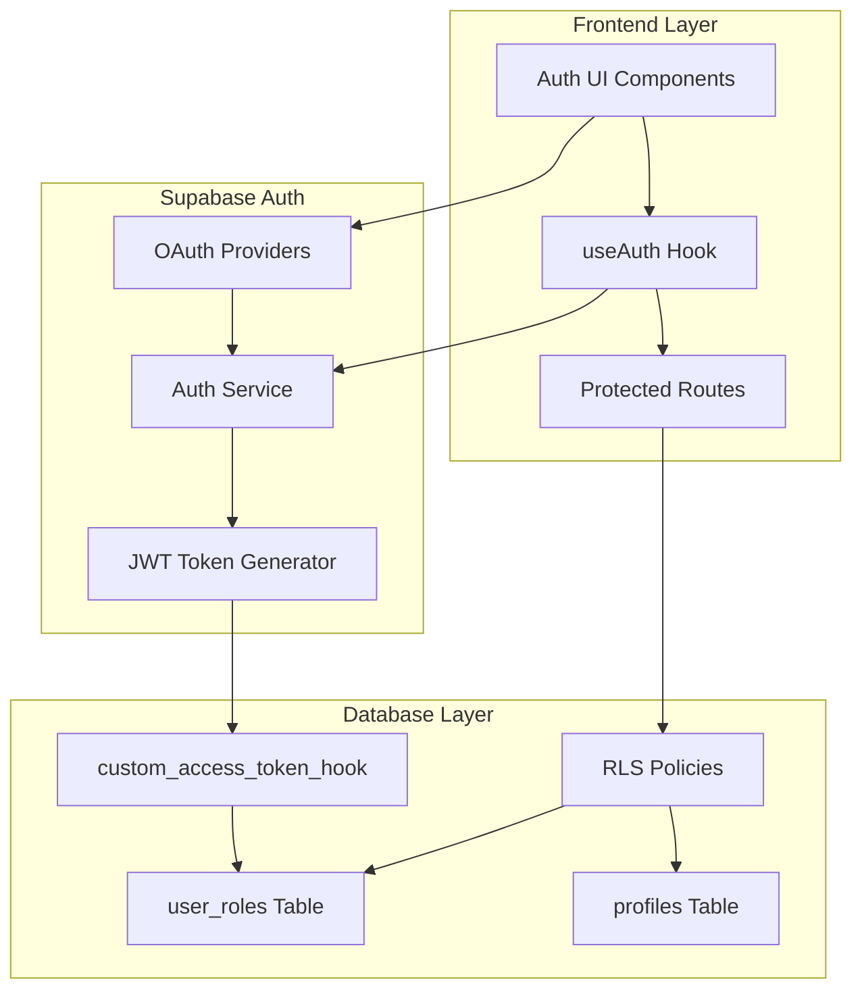
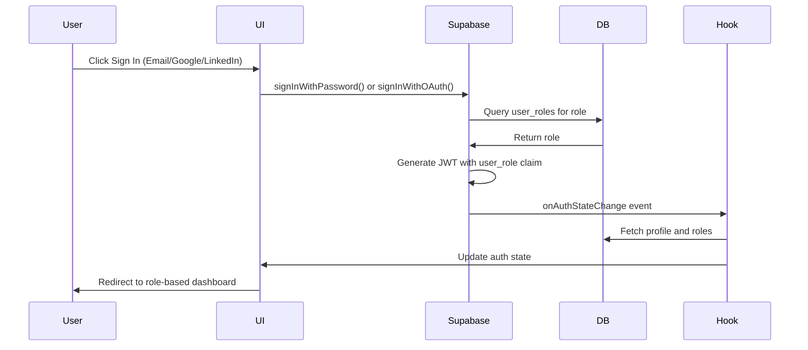
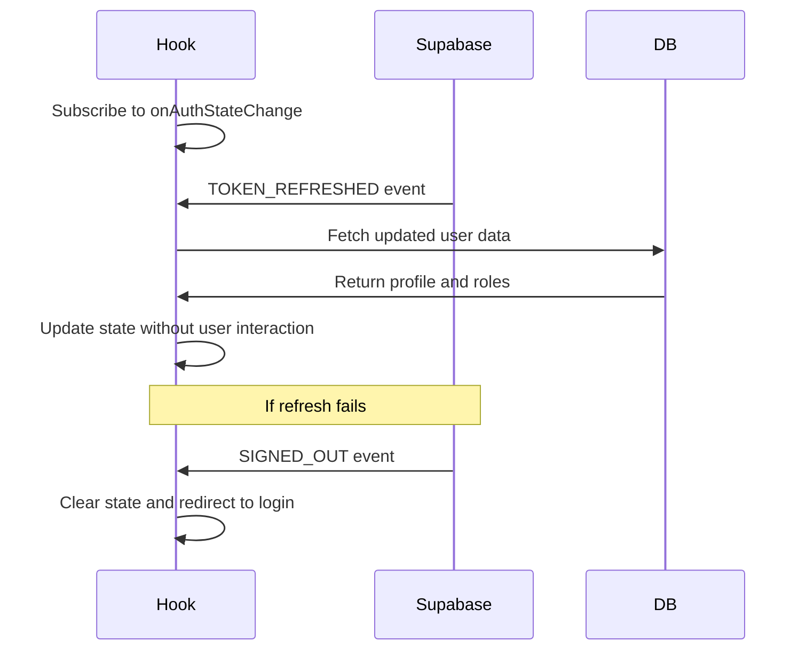

# Design Document: Enhanced Auth & Roles System

## Overview

This design transforms the Grind English authentication system from a basic MVP into an enterprise-ready solution with database-enforced access control, frictionless social authentication, and intelligent user onboarding. The system serves Brazilian corporate professionals learning English, requiring robust security while maintaining a seamless user experience.

### Current State

The existing system has foundational elements in place:
- Supabase Auth integration with email/password authentication
- `user_roles` table with `app_role` enum (admin, curriculum_designer, teacher, learner)
- `profiles` table with basic user metadata
- Frontend role checking via `useAuth` hook
- Database trigger (`handle_new_user`) that auto-creates profiles and assigns learner role
- Basic RLS policies on user_roles and profiles tables

### Design Goals

1. **Database-Level Security**: Enforce role-based access control at the database layer using JWT claims and RLS policies
2. **Frictionless Authentication**: Add Google and LinkedIn OAuth to reduce signup friction for corporate professionals
3. **Intelligent Session Management**: Implement silent token refresh and pre-login destination tracking
4. **Role-Based Routing**: Automatically route users to appropriate dashboards based on their role
5. **Seamless Onboarding**: Capture L1 language and professional goals during first-time authentication
6. **Migration Safety**: Ensure existing users transition smoothly without data loss

## Architecture

### High-Level Architecture



### Authentication Flow



### Token Refresh Flow



## Components and Interfaces

### Database Schema

#### Existing Tables (No Changes Required)

**profiles table**
```sql
CREATE TABLE public.profiles (
  id UUID PRIMARY KEY REFERENCES auth.users(id) ON DELETE CASCADE,
  full_name TEXT,
  avatar_url TEXT,
  created_at TIMESTAMPTZ NOT NULL DEFAULT now(),
  updated_at TIMESTAMPTZ NOT NULL DEFAULT now()
);
```

**user_roles table**
```sql
CREATE TABLE public.user_roles (
  id UUID PRIMARY KEY DEFAULT gen_random_uuid(),
  user_id UUID NOT NULL REFERENCES auth.users(id) ON DELETE CASCADE,
  role public.app_role NOT NULL,
  created_at TIMESTAMPTZ NOT NULL DEFAULT now(),
  UNIQUE (user_id, role)
);
```

#### Schema Enhancements

**profiles table - Add onboarding fields**
```sql
ALTER TABLE public.profiles 
  ADD COLUMN l1_language TEXT DEFAULT 'pt-BR',
  ADD COLUMN professional_goals TEXT,
  ADD COLUMN onboarding_completed BOOLEAN DEFAULT false;
```

**Rationale**: The profiles table needs to capture L1 language (native language) and professional goals for personalized learning. The `onboarding_completed` flag tracks whether the user has completed the initial onboarding flow.

### Database Functions

#### JWT Claims Injection Function

```sql
CREATE OR REPLACE FUNCTION public.custom_access_token_hook(event jsonb)
RETURNS jsonb
LANGUAGE plpgsql
STABLE
SECURITY DEFINER
SET search_path = public
AS $$
DECLARE
  claims jsonb;
  user_role public.app_role;
BEGIN
  -- Fetch the user's primary role
  SELECT role INTO user_role
  FROM public.user_roles
  WHERE user_id = (event->>'user_id')::uuid
  ORDER BY created_at ASC
  LIMIT 1;

  -- Extract existing claims
  claims := event->'claims';

  -- Add custom claim
  IF user_role IS NOT NULL THEN
    claims := jsonb_set(claims, '{user_role}', to_jsonb(user_role::text));
  END IF;

  -- Update the event
  event := jsonb_set(event, '{claims}', claims);

  RETURN event;
END;
$$;
```

**Configuration**: This function must be registered in Supabase Dashboard under Authentication > Hooks > Custom Access Token Hook.

**Rationale**: Supabase's custom access token hook allows us to inject custom claims into the JWT at token generation time. This ensures role information is always available in the token without additional database queries during authorization checks.

### RLS Policy Enhancements

#### Protected Resources Pattern

All protected resources (lessons, progress_tracking, cohorts, etc.) should follow this RLS pattern:

```sql
-- Example: lessons table
CREATE POLICY "Learners can view published lessons"
  ON public.lessons FOR SELECT TO authenticated
  USING (
    published = true 
    AND (
      (SELECT role FROM public.user_roles WHERE user_id = auth.uid() LIMIT 1) = 'learner'
    )
  );

CREATE POLICY "Teachers can view assigned lessons"
  ON public.lessons FOR SELECT TO authenticated
  USING (
    (SELECT role FROM public.user_roles WHERE user_id = auth.uid() LIMIT 1) = 'teacher'
    AND id IN (
      SELECT lesson_id FROM teacher_assignments WHERE teacher_id = auth.uid()
    )
  );

CREATE POLICY "Content creators can manage all lessons"
  ON public.lessons FOR ALL TO authenticated
  USING (
    public.is_content_creator(auth.uid())
  )
  WITH CHECK (
    public.is_content_creator(auth.uid())
  );
```

**Rationale**: RLS policies provide defense-in-depth security by enforcing access control at the database level. Even if frontend code is bypassed, users cannot access data outside their permissions.

#### Progress Tracking RLS

```sql
CREATE POLICY "Users can view own progress"
  ON public.progress_tracking FOR SELECT TO authenticated
  USING (user_id = auth.uid());

CREATE POLICY "Users can insert own progress"
  ON public.progress_tracking FOR INSERT TO authenticated
  WITH CHECK (user_id = auth.uid());

CREATE POLICY "Users can update own progress"
  ON public.progress_tracking FOR UPDATE TO authenticated
  USING (user_id = auth.uid())
  WITH CHECK (user_id = auth.uid());

CREATE POLICY "Teachers can view student progress"
  ON public.progress_tracking FOR SELECT TO authenticated
  USING (
    (SELECT role FROM public.user_roles WHERE user_id = auth.uid() LIMIT 1) = 'teacher'
    AND user_id IN (
      SELECT student_id FROM teacher_student_assignments WHERE teacher_id = auth.uid()
    )
  );

CREATE POLICY "Admins can view all progress"
  ON public.progress_tracking FOR SELECT TO authenticated
  USING (
    public.has_role(auth.uid(), 'admin')
  );
```

### Frontend Components

#### Enhanced useAuth Hook

**Interface**:
```typescript
interface AuthContextType {
  user: User | null;
  session: Session | null;
  profile: Profile | null;
  roles: AppRole[];
  loading: boolean;
  hasRole: (role: AppRole) => boolean;
  isContentCreator: boolean;
  isTeacher: boolean;
  isAdmin: boolean;
  signOut: () => Promise<void>;
  signInWithGoogle: () => Promise<void>;
  signInWithLinkedIn: () => Promise<void>;
  updateProfile: (data: Partial<Profile>) => Promise<void>;
}

interface Profile {
  id: string;
  full_name: string | null;
  avatar_url: string | null;
  l1_language: string;
  professional_goals: string | null;
  onboarding_completed: boolean;
}
```

**Key Enhancements**:
1. Subscribe to `onAuthStateChange` for automatic token refresh handling
2. Add social login methods (`signInWithGoogle`, `signInWithLinkedIn`)
3. Add `updateProfile` method for onboarding data capture
4. Fetch extended profile data including onboarding fields

#### Enhanced ProtectedRoute Component

**Interface**:
```typescript
interface ProtectedRouteProps {
  children: React.ReactNode;
  requiredRoles?: AppRole[];
  requireOnboarding?: boolean;
}
```

**Key Enhancements**:
1. Store attempted URL in sessionStorage as `preLoginDestination`
2. Check `requireOnboarding` flag and redirect to onboarding if incomplete
3. Clear `preLoginDestination` after successful navigation

#### Social Login Buttons

**Component**: `SocialAuthButtons.tsx`

```typescript
interface SocialAuthButtonsProps {
  onGoogleClick: () => Promise<void>;
  onLinkedInClick: () => Promise<void>;
  disabled?: boolean;
}
```

**Design**: Follow existing Google button design pattern from LandingPage, add LinkedIn button with similar styling.

#### Onboarding Form

**Component**: `OnboardingForm.tsx`

```typescript
interface OnboardingFormProps {
  onComplete: (data: OnboardingData) => Promise<void>;
  onSkip: () => void;
}

interface OnboardingData {
  l1_language: string;
  professional_goals: string;
}
```

**Fields**:
- L1 Language: Dropdown with pt-BR as default, options for en, es, pt-BR
- Professional Goals: Textarea with placeholder text in user's language
- Skip button: Allows users to proceed with defaults

## Data Models

### JWT Token Structure

```json
{
  "aud": "authenticated",
  "exp": 1234567890,
  "iat": 1234567890,
  "sub": "user-uuid",
  "email": "user@example.com",
  "user_role": "learner",
  "app_metadata": {},
  "user_metadata": {
    "full_name": "User Name"
  }
}
```

**Key Field**: `user_role` - Custom claim injected by `custom_access_token_hook`

### Session Storage Schema

```typescript
interface SessionStorageData {
  preLoginDestination?: string;
}
```

**Key**: `grind_english_pre_login_destination`

### Role-Based Dashboard Mapping

```typescript
const ROLE_DASHBOARD_MAP: Record<AppRole, string> = {
  learner: '/dashboard',
  teacher: '/teach-dashboard',
  admin: '/course-builder',
  curriculum_designer: '/course-builder'
};
```

## Data Models (continued)

### OAuth Provider Configuration

**Supabase Dashboard Configuration**:

```typescript
// Google OAuth
{
  clientId: process.env.GOOGLE_CLIENT_ID,
  clientSecret: process.env.GOOGLE_CLIENT_SECRET,
  redirectUrl: `${process.env.SUPABASE_URL}/auth/v1/callback`
}

// LinkedIn OAuth
{
  clientId: process.env.LINKEDIN_CLIENT_ID,
  clientSecret: process.env.LINKEDIN_CLIENT_SECRET,
  redirectUrl: `${process.env.SUPABASE_URL}/auth/v1/callback`
}
```

**Scopes**:
- Google: `openid email profile`
- LinkedIn: `openid email profile`

### Migration Data Model

```sql
-- Migration tracking table
CREATE TABLE IF NOT EXISTS public.migration_log (
  id UUID PRIMARY KEY DEFAULT gen_random_uuid(),
  migration_name TEXT NOT NULL,
  executed_at TIMESTAMPTZ NOT NULL DEFAULT now(),
  success BOOLEAN NOT NULL,
  error_message TEXT
);
```


## Correctness Properties

*A property is a characteristic or behavior that should hold true across all valid executions of a system—essentially, a formal statement about what the system should do. Properties serve as the bridge between human-readable specifications and machine-verifiable correctness guarantees.*

### Property Reflection

After analyzing all acceptance criteria, I identified the following redundancies:
- Requirements 10.2, 10.3, 10.4 are all covered by 1.2 (JWT contains role claim)
- Requirements 7.1-7.4 are specific examples of the general property 7.5 (role-based routing with pre-login precedence)
- Multiple RLS requirements (2.2-2.5) can be consolidated into comprehensive data isolation properties

The following properties represent the unique, non-redundant correctness guarantees:

### Property 1: JWT Role Claim Injection

*For any* user with an assigned role in the user_roles table, when that user authenticates, the generated JWT token should contain a 'user_role' claim with the correct role value.

**Validates: Requirements 1.2, 1.4, 10.2, 10.3, 10.4**

### Property 2: Single Role Per User Constraint

*For any* user, attempting to insert a second role with the same user_id should be rejected by the database unique constraint, ensuring exactly one role per user.

**Validates: Requirements 1.3**

### Property 3: Learner Data Isolation

*For any* learner user and any query to progress_tracking or other learner-scoped resources, the RLS policy should return only records where user_id matches the authenticated user's ID, ensuring learners cannot access other learners' data.

**Validates: Requirements 2.2, 2.5**

### Property 4: Teacher Assignment Scoping

*For any* teacher user and any query to lessons or student data, the RLS policy should return only resources explicitly assigned to that teacher, ensuring teachers cannot access unassigned content.

**Validates: Requirements 2.3, 2.5**

### Property 5: Admin Full Access

*For any* admin user and any protected resource, the RLS policy should grant full read access to all records, ensuring admins can view all system data.

**Validates: Requirements 2.4**

### Property 6: OAuth Trigger Consistency

*For any* new user created via Google or LinkedIn OAuth (first-time authentication), the onboarding trigger should execute, creating a profile record with default values (l1_language='pt-BR') and assigning the learner role.

**Validates: Requirements 3.5, 4.5, 8.2, 8.3**

### Property 7: Pre-Login Destination Storage

*For any* unauthenticated user attempting to access a protected route, the system should store the requested URL in sessionStorage, and upon successful authentication, redirect to that stored URL if it exists.

**Validates: Requirements 6.1, 6.2, 6.4**

### Property 8: Role-Based Default Routing

*For any* authenticated user without a pre-login destination, the system should redirect to the dashboard route corresponding to their role (learner→/dashboard, teacher→/teach-dashboard, admin/curriculum_designer→/course-builder).

**Validates: Requirements 6.3, 7.1, 7.2, 7.3, 7.4, 7.5**

### Property 9: Onboarding Data Persistence

*For any* user submitting the onboarding form with L1 language and professional goals, the system should update the user's profile record with the submitted data and set onboarding_completed to true.

**Validates: Requirements 9.4, 9.5**

### Property 10: Authentication Method Parity

*For any* user authenticating via email/password or OAuth, the resulting session management, token refresh behavior, and routing logic should be identical, ensuring consistent user experience across authentication methods.

**Validates: Requirements 11.4**

### Property 11: Password Strength Enforcement

*For any* password submitted during signup or password change, the system should reject passwords that don't meet the strength requirements (minimum 8 characters, at least one number), preventing weak passwords.

**Validates: Requirements 11.5**

### Property 12: Admin Role Assignment Authorization

*For any* user attempting to access the role assignment interface or modify user roles, the system should verify the user has the admin role, denying access to non-admin users.

**Validates: Requirements 12.2, 12.3**

### Property 13: Role Assignment Audit Logging

*For any* role assignment or modification performed by an admin, the system should create an audit log entry containing the timestamp, admin user ID, target user ID, and new role value.

**Validates: Requirements 12.5**

## Error Handling

### Authentication Errors

**Invalid Credentials**:
- Display localized error message: "Email ou senha incorretos" (pt-BR) or "Invalid email or password" (en)
- Log error to console with sanitized details (no password exposure)
- Maintain form state to allow retry

**OAuth Failures**:
- Capture provider-specific error from Supabase
- Display user-friendly message with error reason
- Provide fallback to email/password authentication
- Log full error details for debugging

**Token Refresh Failures**:
- Detect `SIGNED_OUT` event from `onAuthStateChange`
- Display session expiry message: "Sua sessão expirou. Por favor, faça login novamente"
- Clear local auth state
- Redirect to login page with pre-login destination stored

**Network Errors**:
- Detect network failures during auth requests
- Display connectivity message: "Erro de conexão. Verifique sua internet"
- Implement retry logic with exponential backoff
- Cache auth state for offline resilience

### Database Errors

**RLS Policy Violations**:
- Return empty result set (zero rows) for unauthorized queries
- Log policy violation with user ID and attempted resource
- Do not expose policy details to client

**Trigger Failures**:
- Log trigger errors (profile creation, role assignment)
- Allow authentication to proceed (non-blocking)
- Implement retry mechanism for failed profile creation
- Alert admins for persistent trigger failures

**Constraint Violations**:
- Catch unique constraint violations (duplicate roles)
- Display user-friendly error message
- Log violation details for debugging

### Frontend Errors

**Component Mount Failures**:
- Implement error boundaries around auth components
- Display fallback UI with retry option
- Log component errors to monitoring service

**State Synchronization Issues**:
- Detect mismatches between local state and server state
- Force re-fetch of user data
- Clear stale cache entries

## Testing Strategy

### Dual Testing Approach

This feature requires both unit tests and property-based tests to ensure comprehensive coverage:

**Unit Tests**: Focus on specific examples, edge cases, UI interactions, and error conditions
**Property Tests**: Verify universal properties across all inputs using randomized test data

Both approaches are complementary and necessary for production readiness.

### Property-Based Testing

**Library**: Use `fast-check` for TypeScript/JavaScript property-based testing

**Configuration**:
- Minimum 100 iterations per property test
- Each test must reference its design document property
- Tag format: `Feature: enhanced-auth-roles-system, Property {number}: {property_text}`

**Property Test Examples**:

```typescript
// Property 1: JWT Role Claim Injection
test('Feature: enhanced-auth-roles-system, Property 1: JWT contains correct role claim', async () => {
  await fc.assert(
    fc.asyncProperty(
      fc.constantFrom('admin', 'curriculum_designer', 'teacher', 'learner'),
      async (role) => {
        // Create user with role
        const user = await createTestUser({ role });
        
        // Authenticate
        const { session } = await supabase.auth.signInWithPassword({
          email: user.email,
          password: user.password
        });
        
        // Verify JWT contains role
        const token = parseJWT(session.access_token);
        expect(token.user_role).toBe(role);
        
        // Cleanup
        await deleteTestUser(user.id);
      }
    ),
    { numRuns: 100 }
  );
});

// Property 3: Learner Data Isolation
test('Feature: enhanced-auth-roles-system, Property 3: Learners see only own progress', async () => {
  await fc.assert(
    fc.asyncProperty(
      fc.array(fc.record({ userId: fc.uuid(), progress: fc.integer() }), { minLength: 2 }),
      async (progressRecords) => {
        // Create progress records for multiple users
        await createProgressRecords(progressRecords);
        
        // Pick a random learner
        const learner = progressRecords[0];
        
        // Query as that learner
        const { data } = await supabase
          .from('progress_tracking')
          .select('*')
          .eq('user_id', learner.userId);
        
        // Verify only own records returned
        expect(data.every(r => r.user_id === learner.userId)).toBe(true);
        
        // Cleanup
        await cleanupProgressRecords(progressRecords);
      }
    ),
    { numRuns: 100 }
  );
});
```

### Unit Testing

**Focus Areas**:
- UI component rendering (social login buttons, onboarding form)
- Specific error messages for known error conditions
- Session storage operations
- Route protection logic
- Migration script execution

**Unit Test Examples**:

```typescript
// UI presence test
test('Google sign-in button appears on landing page', () => {
  render(<LandingPage />);
  expect(screen.getByText(/Continue with Google/i)).toBeInTheDocument();
});

// Error message test
test('Invalid credentials show correct error message', async () => {
  const { signIn } = renderAuthHook();
  await signIn('invalid@example.com', 'wrongpassword');
  expect(screen.getByText(/Email ou senha incorretos/i)).toBeInTheDocument();
});

// Session storage test
test('Pre-login destination stored in sessionStorage', () => {
  const { result } = renderHook(() => useProtectedRoute('/protected-page'));
  expect(sessionStorage.getItem('grind_english_pre_login_destination')).toBe('/protected-page');
});
```

### Integration Testing

**Scenarios**:
1. Complete OAuth flow (Google/LinkedIn) → profile creation → role assignment → dashboard redirect
2. Email/password signup → onboarding form → data persistence → dashboard access
3. Token refresh during active session → state update without user interaction
4. Pre-login destination → authentication → redirect to original destination
5. Role change by admin → user re-authentication → updated JWT claims

### Migration Testing

**Verification Steps**:
1. Create test database with existing users (some with roles, some without)
2. Run migration script
3. Verify all users have exactly one role
4. Verify all users have profile records
5. Verify no data loss in existing records
6. Run migration again to verify idempotency

## Implementation Approach

### Phase 1: Database Hardening (Requirements 1, 2, 10)

**Tasks**:
1. Add onboarding fields to profiles table
2. Create `custom_access_token_hook` function
3. Register hook in Supabase Dashboard
4. Implement comprehensive RLS policies for all protected resources
5. Test JWT claim injection with various roles
6. Verify RLS policies block unauthorized access

**Deliverables**:
- Migration file: `add_onboarding_fields.sql`
- Migration file: `create_jwt_claims_hook.sql`
- Migration file: `comprehensive_rls_policies.sql`
- Test suite: `jwt-claims.test.ts`
- Test suite: `rls-policies.test.ts`

### Phase 2: Social Login Integration (Requirements 3, 4, 11)

**Tasks**:
1. Configure Google OAuth in Supabase Dashboard
2. Configure LinkedIn OAuth in Supabase Dashboard
3. Create `SocialAuthButtons` component
4. Update `LandingPage` to include LinkedIn button
5. Test OAuth flows end-to-end
6. Verify trigger fires for new OAuth users

**Deliverables**:
- Component: `src/components/auth/SocialAuthButtons.tsx`
- Updated: `src/pages/LandingPage.tsx`
- Test suite: `social-auth.test.ts`
- Documentation: OAuth setup guide

### Phase 3: Intelligent Routing (Requirements 5, 6, 7)

**Tasks**:
1. Enhance `useAuth` hook with token refresh handling
2. Update `ProtectedRoute` to store pre-login destination
3. Implement role-based dashboard routing logic
4. Add session storage utilities
5. Test token refresh scenarios
6. Test pre-login destination flow

**Deliverables**:
- Updated: `src/hooks/useAuth.tsx`
- Updated: `src/components/auth/ProtectedRoute.tsx`
- Utility: `src/lib/routing-utils.ts`
- Test suite: `intelligent-routing.test.ts`

### Phase 4: Onboarding Flow (Requirements 8, 9)

**Tasks**:
1. Create `OnboardingForm` component
2. Create onboarding page/modal
3. Add onboarding completion check to routing logic
4. Implement profile update API
5. Test onboarding data capture and persistence
6. Test skip functionality

**Deliverables**:
- Component: `src/components/auth/OnboardingForm.tsx`
- Page: `src/pages/OnboardingPage.tsx`
- Updated: `src/hooks/useAuth.tsx` (add updateProfile method)
- Test suite: `onboarding.test.ts`

### Phase 5: Admin Role Management (Requirement 12)

**Tasks**:
1. Create admin role assignment interface
2. Implement role update API with authorization
3. Add audit logging for role changes
4. Test admin-only access control
5. Test role change flow

**Deliverables**:
- Component: `src/components/admin/RoleManagement.tsx`
- Page: `src/pages/AdminUsersPage.tsx`
- Migration: `create_role_audit_log.sql`
- Test suite: `role-management.test.ts`

### Phase 6: Error Handling & Security (Requirements 13, 14)

**Tasks**:
1. Implement comprehensive error handling in auth components
2. Add localized error messages
3. Configure session and refresh token expiration
4. Test all error scenarios
5. Verify security configurations (HTTPS, httpOnly cookies)

**Deliverables**:
- Utility: `src/lib/auth-errors.ts`
- Updated: All auth components with error handling
- Test suite: `auth-errors.test.ts`
- Security audit checklist

### Phase 7: Migration & Deployment (Requirement 15)

**Tasks**:
1. Create migration script for existing users
2. Test migration on staging database
3. Verify idempotency
4. Create rollback plan
5. Execute production migration
6. Verify all users have roles and profiles

**Deliverables**:
- Migration: `migrate_existing_users.sql`
- Script: `verify_migration.sql`
- Documentation: Migration runbook
- Rollback script: `rollback_migration.sql`

## Deployment Considerations

### Supabase Configuration

**Required Dashboard Settings**:
1. Authentication > Providers > Google: Enable and configure client ID/secret
2. Authentication > Providers > LinkedIn: Enable and configure client ID/secret
3. Authentication > Hooks > Custom Access Token: Register `custom_access_token_hook`
4. Authentication > Settings > JWT Expiry: Set to 3600 seconds (1 hour)
5. Authentication > Settings > Refresh Token Expiry: Set to 2592000 seconds (30 days)

### Environment Variables

```bash
# OAuth Credentials
GOOGLE_CLIENT_ID=your_google_client_id
GOOGLE_CLIENT_SECRET=your_google_client_secret
LINKEDIN_CLIENT_ID=your_linkedin_client_id
LINKEDIN_CLIENT_SECRET=your_linkedin_client_secret

# Supabase
VITE_SUPABASE_URL=your_supabase_url
VITE_SUPABASE_ANON_KEY=your_supabase_anon_key
```

### Migration Sequence

1. **Pre-deployment**: Backup production database
2. **Deploy database changes**: Run migrations in order
   - `add_onboarding_fields.sql`
   - `create_jwt_claims_hook.sql`
   - `comprehensive_rls_policies.sql`
   - `create_role_audit_log.sql`
3. **Configure Supabase**: Update dashboard settings
4. **Deploy frontend**: Deploy updated application code
5. **Run user migration**: Execute `migrate_existing_users.sql`
6. **Verify**: Run `verify_migration.sql` to confirm all users have roles and profiles
7. **Monitor**: Watch error logs for auth issues

### Rollback Plan

If critical issues arise:
1. Revert frontend deployment to previous version
2. Disable OAuth providers in Supabase Dashboard
3. Remove custom access token hook registration
4. Run `rollback_migration.sql` to restore previous state
5. Restore database from backup if necessary

### Monitoring

**Key Metrics**:
- Authentication success/failure rates by method (email, Google, LinkedIn)
- Token refresh success/failure rates
- RLS policy violation counts
- Onboarding completion rates
- Average time to complete onboarding
- Role assignment changes per day

**Alerts**:
- Authentication failure rate > 5%
- Token refresh failure rate > 2%
- Trigger failure rate > 0.1%
- RLS policy violations > 10/hour

## Security Considerations

### Defense in Depth

1. **Database Layer**: RLS policies enforce access control even if application logic is bypassed
2. **JWT Layer**: Role claims in tokens prevent token manipulation
3. **Application Layer**: Frontend checks provide immediate feedback
4. **Audit Layer**: All role changes logged for forensic analysis

### Threat Mitigation

**Threat**: User attempts to access another user's data
**Mitigation**: RLS policies return zero rows for unauthorized queries

**Threat**: User attempts to escalate privileges by modifying JWT
**Mitigation**: JWT signed by Supabase, tampering invalidates signature

**Threat**: User attempts to assign themselves admin role
**Mitigation**: Role assignment interface restricted to admins via RLS

**Threat**: OAuth account takeover
**Mitigation**: Email verification required, Supabase handles OAuth security

**Threat**: Session hijacking
**Mitigation**: httpOnly cookies, HTTPS only, short token expiration

### Compliance

**LGPD (Brazilian Data Protection Law)**:
- User data (email, profile) stored with explicit consent
- Users can request data deletion (implement in future phase)
- Audit logs track all data access and modifications

**GDPR (if expanding to EU)**:
- Right to access: Users can view their profile data
- Right to erasure: Implement account deletion flow
- Data portability: Implement profile export functionality

