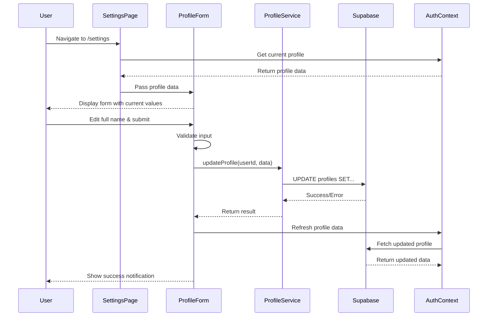

# Design Document: User Settings Page

## Overview

The User Settings Page feature implements a personal settings interface for authenticated users to manage their profile information. This feature addresses the current 404 error when users click "Settings" from the profile dropdown menu by creating a functional `/settings` route with a form-based interface for updating profile data.

The initial implementation focuses on enabling users to update their full name, with an extensible architecture that supports adding additional profile fields and settings sections in future iterations. The design emphasizes security through Row Level Security (RLS) policies, user experience through form validation and feedback, and consistency with the existing application layout patterns.

### Key Design Goals

- Provide a secure, user-friendly interface for profile management
- Ensure only authenticated users can access their own profile data
- Maintain consistency with existing application UI patterns (AppLayout, form components)
- Support future extensibility for additional settings and profile fields
- Implement comprehensive validation and error handling

## Architecture

### Component Hierarchy

```
SettingsPage (Route: /settings)
  └── AppLayout
      └── SettingsPageContent
          └── ProfileSection
              └── ProfileForm
                  ├── FormField (Full Name)
                  ├── FormField (Email - Read Only)
                  └── FormActions (Save Button)
```

### Layer Responsibilities

1. **Route Layer** (`/settings` in App.tsx)
   - Wraps SettingsPage with ProtectedRoute for authentication
   - No role restrictions (accessible to all authenticated users)

2. **Page Layer** (`SettingsPage.tsx`)
   - Manages page-level state and layout
   - Coordinates between UI components and service layer
   - Handles navigation guards for unsaved changes

3. **Component Layer** (`ProfileForm.tsx`)
   - Manages form state using react-hook-form
   - Implements client-side validation
   - Handles form submission and user feedback

4. **Service Layer** (`profileService.ts`)
   - Encapsulates Supabase database operations
   - Provides type-safe profile update methods
   - Handles error transformation and logging

5. **Context Layer** (`useAuth` hook)
   - Provides current user and profile data
   - Exposes profile refresh method for post-update synchronization

### Data Flow



## Components and Interfaces

### 1. SettingsPage Component

**File**: `src/pages/SettingsPage.tsx`

**Purpose**: Top-level page component that orchestrates the settings interface

**Props**: None (uses hooks for data)

**State**:
- `hasUnsavedChanges: boolean` - Tracks if form has unsaved modifications
- `isNavigating: boolean` - Tracks navigation intent for confirmation dialog

**Key Responsibilities**:
- Render AppLayout with appropriate title and subtitle
- Provide navigation guard for unsaved changes
- Coordinate between ProfileForm and AuthContext

**Dependencies**:
- `useAuth()` - Access current user and profile
- `useNavigate()` - Handle navigation
- `AppLayout` - Consistent page layout
- `ProfileForm` - Profile editing interface

### 2. ProfileForm Component

**File**: `src/components/settings/ProfileForm.tsx`

**Purpose**: Form component for editing profile information

**Props**:
```typescript
interface ProfileFormProps {
  profile: Profile;
  onSave: (data: ProfileUpdateData) => Promise<void>;
  onDirtyChange: (isDirty: boolean) => void;
}
```

**Form Schema** (using zod):
```typescript
const profileFormSchema = z.object({
  fullName: z.string()
    .max(255, "Full name must not exceed 255 characters")
    .transform(val => val.trim()),
  email: z.string().email() // Read-only, for display
});
```

**State** (managed by react-hook-form):
- Form values (fullName, email)
- Validation errors
- Dirty state (tracks changes)
- Submission state (loading, success, error)

**Key Responsibilities**:
- Render form fields with proper validation
- Trim whitespace from full name before submission
- Disable save button when no changes or during submission
- Display loading state during submission
- Show success/error notifications
- Notify parent of dirty state changes

**Dependencies**:
- `react-hook-form` - Form state management
- `zod` - Schema validation
- `@/components/ui/form` - Form UI components
- `@/components/ui/button` - Action buttons
- `@/components/ui/input` - Text inputs
- `sonner` - Toast notifications

### 3. ProfileService

**File**: `src/services/profileService.ts`

**Purpose**: Service layer for profile data operations

**Interface**:
```typescript
export interface ProfileUpdateData {
  fullName: string;
}

export interface ProfileServiceError {
  message: string;
  code?: string;
  details?: unknown;
}

export const profileService = {
  /**
   * Updates the authenticated user's profile
   * @param userId - The authenticated user's ID
   * @param data - Profile fields to update
   * @returns Updated profile data
   * @throws ProfileServiceError on failure
   */
  updateProfile: async (
    userId: string,
    data: ProfileUpdateData
  ): Promise<Profile> => {
    // Implementation
  },

  /**
   * Fetches the current user's profile
   * @param userId - The user's ID
   * @returns Profile data
   * @throws ProfileServiceError on failure
   */
  getProfile: async (userId: string): Promise<Profile> => {
    // Implementation
  }
};
```

**Key Responsibilities**:
- Execute Supabase queries for profile operations
- Transform ProfileUpdateData to database column format
- Handle and transform Supabase errors to ProfileServiceError
- Validate userId is provided
- Log errors for debugging

**Error Handling**:
- RLS policy violations → "You can only update your own profile"
- Network errors → "Unable to connect. Please check your connection"
- Validation errors → Pass through specific validation message
- Unknown errors → "An unexpected error occurred"

### 4. AuthContext Enhancement

**File**: `src/hooks/useAuth.tsx`

**Enhancement**: Add profile refresh method

**New Method**:
```typescript
interface AuthContextType {
  // ... existing properties
  refreshProfile: () => Promise<void>;
}
```

**Implementation**:
```typescript
const refreshProfile = async () => {
  if (user?.id) {
    await fetchUserData(user.id);
  }
};
```

**Purpose**: Allow components to trigger profile data refresh after updates

## Data Models

### Profile Table Schema

**Table**: `public.profiles`

**Existing Columns**:
```sql
CREATE TABLE public.profiles (
  id UUID PRIMARY KEY REFERENCES auth.users(id) ON DELETE CASCADE,
  full_name TEXT,
  avatar_url TEXT,
  created_at TIMESTAMPTZ NOT NULL DEFAULT now(),
  updated_at TIMESTAMPTZ NOT NULL DEFAULT now(),
  -- Additional columns from migrations:
  l1_language TEXT DEFAULT 'pt-BR',
  professional_goals TEXT,
  onboarding_completed BOOLEAN DEFAULT false
);
```

**Relevant Columns for This Feature**:
- `id` (UUID) - Primary key, references auth.users
- `full_name` (TEXT) - User's full name (editable in settings)
- `avatar_url` (TEXT) - Profile picture URL (future enhancement)
- `updated_at` (TIMESTAMPTZ) - Auto-updated via trigger

**Constraints**:
- `full_name` max length: 255 characters (enforced client-side)
- `updated_at` automatically updated via `update_profiles_updated_at` trigger

### TypeScript Types

**Profile Type** (from existing codebase):
```typescript
interface Profile {
  id: string;
  full_name: string | null;
  avatar_url: string | null;
}
```

**Form Data Type**:
```typescript
interface ProfileFormData {
  fullName: string;
  email: string; // Read-only, from auth.users
}
```

**Update Payload Type**:
```typescript
interface ProfileUpdateData {
  fullName: string;
}
```

### Row Level Security (RLS) Policies

**Existing Policies** (from migration `20260217120101`):

1. **SELECT Policy**: "Anyone authenticated can view profiles"
   ```sql
   CREATE POLICY "Anyone authenticated can view profiles"
     ON public.profiles FOR SELECT TO authenticated 
     USING (true);
   ```

2. **UPDATE Policy**: "Users can update own profile"
   ```sql
   CREATE POLICY "Users can update own profile"
     ON public.profiles FOR UPDATE TO authenticated
     USING (auth.uid() = id);
   ```

**Policy Validation**:
- The existing UPDATE policy ensures users can only modify their own profile
- The policy uses `auth.uid()` to get the authenticated user's ID
- Attempts to update other users' profiles will be rejected by Supabase
- No additional RLS policies needed for this feature

**Security Guarantees**:
- Users cannot update profiles where `id != auth.uid()`
- Even if client code attempts to update another user's profile, RLS blocks it
- Admin users have separate policies (from `20260310000000_comprehensive_rls_policies.sql`)

## Correctness Properties

*A property is a characteristic or behavior that should hold true across all valid executions of a system—essentially, a formal statement about what the system should do. Properties serve as the bridge between human-readable specifications and machine-verifiable correctness guarantees.*

### Property 1: Role-Based Access

*For any* authenticated user with any role (learner, teacher, curriculum_designer, admin), that user should be able to access the `/settings` route and view the settings page.

**Validates: Requirements 1.3**

### Property 2: Profile Data Display

*For any* authenticated user, when the settings page loads, the profile form should display that user's current full name from the database.

**Validates: Requirements 2.1**

### Property 3: Email Read-Only Display

*For any* authenticated user, the settings page should display that user's email address in a read-only format (not editable).

**Validates: Requirements 2.4**

### Property 4: Profile Update Round-Trip

*For any* authenticated user and any valid full name string, when the user updates their full name and saves, then:
1. The database should contain the new full name value
2. The auth context should reflect the updated full name
3. The `updated_at` timestamp should be more recent than before the update

**Validates: Requirements 3.2, 3.4, 6.4**

### Property 5: Full Name Length Validation

*For any* string longer than 255 characters, the profile form should reject it with a validation error and prevent submission.

**Validates: Requirements 3.6**

### Property 6: Unchanged Form Submission Prevention

*For any* form state that is identical to the initial profile data, the save button should be disabled and submission should be prevented.

**Validates: Requirements 4.3**

### Property 7: Whitespace Trimming

*For any* full name string with leading or trailing whitespace, the submitted value to the database should have all leading and trailing whitespace removed.

**Validates: Requirements 4.5**

### Property 8: Own Profile Update Authorization

*For any* authenticated user, that user should be able to successfully update their own profile's full name field.

**Validates: Requirements 6.1**

### Property 9: Other Profile Update Rejection

*For any* authenticated user attempting to update a profile where the profile ID does not match their user ID, the update should be rejected with an authorization error.

**Validates: Requirements 6.2**

## Error Handling

### Error Categories and Responses

1. **Authentication Errors**
   - **Scenario**: User not authenticated or session expired
   - **Handling**: ProtectedRoute redirects to `/login`
   - **User Message**: None (automatic redirect)

2. **Authorization Errors**
   - **Scenario**: RLS policy violation (attempting to update another user's profile)
   - **Handling**: Catch error in profileService, return specific error
   - **User Message**: "You can only update your own profile"
   - **UI**: Error toast notification (red)

3. **Validation Errors**
   - **Scenario**: Client-side validation fails (e.g., name too long)
   - **Handling**: react-hook-form prevents submission, displays field error
   - **User Message**: Specific validation message (e.g., "Full name must not exceed 255 characters")
   - **UI**: Red text below input field

4. **Network Errors**
   - **Scenario**: No internet connection or Supabase unreachable
   - **Handling**: Catch error in profileService
   - **User Message**: "Unable to connect. Please check your connection and try again"
   - **UI**: Error toast notification (red)

5. **Database Errors**
   - **Scenario**: Unexpected database error (constraint violation, etc.)
   - **Handling**: Catch error in profileService, log details
   - **User Message**: "An unexpected error occurred. Please try again"
   - **UI**: Error toast notification (red)

6. **Unsaved Changes Navigation**
   - **Scenario**: User attempts to navigate away with unsaved changes
   - **Handling**: beforeunload event listener + React Router navigation guard
   - **User Message**: "You have unsaved changes. Are you sure you want to leave?"
   - **UI**: Browser confirmation dialog

### Error Handling Implementation

**ProfileService Error Transformation**:
```typescript
try {
  const { data, error } = await supabase
    .from('profiles')
    .update({ full_name: data.fullName })
    .eq('id', userId)
    .select()
    .single();

  if (error) throw error;
  return data;
} catch (error) {
  if (error.code === 'PGRST301') {
    // RLS policy violation
    throw new ProfileServiceError('You can only update your own profile');
  }
  if (error.message?.includes('network')) {
    throw new ProfileServiceError('Unable to connect. Please check your connection');
  }
  // Log unexpected errors
  console.error('Profile update error:', error);
  throw new ProfileServiceError('An unexpected error occurred. Please try again');
}
```

**Component Error Handling**:
```typescript
const onSubmit = async (data: ProfileFormData) => {
  try {
    setIsSubmitting(true);
    await profileService.updateProfile(user.id, { fullName: data.fullName });
    await refreshProfile();
    toast.success('Profile updated successfully');
    reset(data); // Reset form dirty state
  } catch (error) {
    toast.error(error.message || 'Failed to update profile');
  } finally {
    setIsSubmitting(false);
  }
};
```

### Loading States

1. **Initial Page Load**
   - Show skeleton loader for form fields
   - Display once profile data is fetched from AuthContext

2. **Form Submission**
   - Disable save button
   - Show loading spinner on save button
   - Disable form inputs to prevent changes during submission

3. **Profile Refresh**
   - No visible loading state (happens in background)
   - Success toast indicates completion

## Testing Strategy

### Dual Testing Approach

This feature will be tested using both unit tests and property-based tests to ensure comprehensive coverage:

- **Unit tests**: Verify specific examples, edge cases, UI interactions, and error conditions
- **Property tests**: Verify universal properties across all inputs using randomized test data

Both testing approaches are complementary and necessary for comprehensive validation.

### Unit Testing

**Framework**: Vitest + React Testing Library

**Test Files**:
- `src/pages/SettingsPage.test.tsx`
- `src/components/settings/ProfileForm.test.tsx`
- `src/services/profileService.test.ts`

**Unit Test Coverage**:

1. **Route and Authentication** (Examples)
   - `/settings` route renders SettingsPage component
   - Unauthenticated users are redirected to `/login`
   - Settings link in profile dropdown navigates to `/settings`

2. **UI State and Interactions** (Examples)
   - Loading indicator displays while profile data loads
   - Empty input field when full name is null/empty (edge case)
   - Form has editable full name input
   - Email displays in read-only format
   - Save button disabled during submission
   - Loading spinner shows on save button during submission
   - Success notification displays after successful update
   - Error notification displays after failed update
   - Confirmation dialog shows when navigating with unsaved changes

3. **Layout and Content** (Examples)
   - Page uses AppLayout component
   - Page title is "Settings"
   - Page subtitle is "Manage your personal information"
   - Settings organized into "Profile Information" section

4. **Error Handling** (Examples)
   - Authorization error shows appropriate message
   - Network error shows appropriate message
   - Database error shows generic error message

### Property-Based Testing

**Framework**: fast-check (JavaScript property-based testing library)

**Configuration**: Minimum 100 iterations per property test

**Test File**: `src/test/properties/userSettings.property.test.ts`

**Property Test Coverage**:

Each property test will be tagged with a comment referencing the design document property:

1. **Property 1: Role-Based Access**
   ```typescript
   // Feature: user-settings-page, Property 1: Role-Based Access
   ```
   - Generate: Random user with random role (learner, teacher, curriculum_designer, admin)
   - Test: User can access `/settings` route
   - Assert: Page renders successfully

2. **Property 2: Profile Data Display**
   ```typescript
   // Feature: user-settings-page, Property 2: Profile Data Display
   ```
   - Generate: Random user with random full name (including null, empty, valid strings)
   - Test: Load settings page
   - Assert: Form displays the generated full name

3. **Property 3: Email Read-Only Display**
   ```typescript
   // Feature: user-settings-page, Property 3: Email Read-Only Display
   ```
   - Generate: Random user with random email
   - Test: Load settings page
   - Assert: Email field is read-only and displays correct email

4. **Property 4: Profile Update Round-Trip**
   ```typescript
   // Feature: user-settings-page, Property 4: Profile Update Round-Trip
   ```
   - Generate: Random user and random valid full name string (1-255 chars)
   - Test: Update full name and save
   - Assert: Database contains new value, auth context reflects new value, updated_at changed

5. **Property 5: Full Name Length Validation**
   ```typescript
   // Feature: user-settings-page, Property 5: Full Name Length Validation
   ```
   - Generate: Random string longer than 255 characters
   - Test: Attempt to submit form
   - Assert: Validation error shown, submission prevented

6. **Property 6: Unchanged Form Submission Prevention**
   ```typescript
   // Feature: user-settings-page, Property 6: Unchanged Form Submission Prevention
   ```
   - Generate: Random user with random full name
   - Test: Load form without making changes
   - Assert: Save button is disabled

7. **Property 7: Whitespace Trimming**
   ```typescript
   // Feature: user-settings-page, Property 7: Whitespace Trimming
   ```
   - Generate: Random valid full name with random leading/trailing whitespace
   - Test: Submit form
   - Assert: Database value has whitespace trimmed

8. **Property 8: Own Profile Update Authorization**
   ```typescript
   // Feature: user-settings-page, Property 8: Own Profile Update Authorization
   ```
   - Generate: Random user and random valid full name
   - Test: Update own profile
   - Assert: Update succeeds

9. **Property 9: Other Profile Update Rejection**
   ```typescript
   // Feature: user-settings-page, Property 9: Other Profile Update Rejection
   ```
   - Generate: Two random users (user A and user B)
   - Test: User A attempts to update user B's profile via service
   - Assert: Update fails with authorization error

### Test Data Generators

**For Property-Based Tests**:
```typescript
// Arbitrary generators using fast-check
const arbRole = fc.constantFrom('learner', 'teacher', 'curriculum_designer', 'admin');
const arbEmail = fc.emailAddress();
const arbValidFullName = fc.string({ minLength: 1, maxLength: 255 });
const arbFullNameWithWhitespace = fc.tuple(
  fc.string({ maxLength: 10 }).filter(s => /^\s+$/.test(s)), // leading whitespace
  arbValidFullName,
  fc.string({ maxLength: 10 }).filter(s => /^\s+$/.test(s))  // trailing whitespace
).map(([leading, name, trailing]) => leading + name + trailing);
const arbTooLongFullName = fc.string({ minLength: 256, maxLength: 500 });
const arbUserId = fc.uuid();
```

### Integration Testing

**Scope**: End-to-end user flows

**Test Scenarios**:
1. Complete profile update flow (login → navigate to settings → update name → verify change)
2. Unsaved changes navigation guard (edit form → attempt navigation → confirm/cancel)
3. Error recovery (trigger error → dismiss notification → retry successfully)

### Testing Balance

- **Unit tests**: Focus on specific UI states, user interactions, and error conditions
- **Property tests**: Focus on universal behaviors across all valid inputs
- Together, these approaches provide comprehensive coverage without excessive redundancy
- Property tests handle the "many inputs" case, so unit tests can focus on specific examples and edge cases

---

## Implementation Notes

### Dependencies

**New Dependencies**: None (all required libraries already in project)

**Existing Dependencies Used**:
- `react-hook-form` - Form state management
- `zod` - Schema validation
- `@supabase/supabase-js` - Database operations
- `sonner` - Toast notifications
- `@/components/ui/*` - UI components (form, button, input, card)

### File Structure

```
src/
├── pages/
│   └── SettingsPage.tsx (NEW)
├── components/
│   └── settings/
│       └── ProfileForm.tsx (NEW)
├── services/
│   └── profileService.ts (NEW)
├── hooks/
│   └── useAuth.tsx (MODIFY - add refreshProfile)
└── test/
    └── properties/
        └── userSettings.property.test.ts (NEW)
```

### Route Configuration

**File**: `src/App.tsx`

**Addition**:
```typescript
import SettingsPage from "./pages/SettingsPage";

// In Routes:
<Route path="/settings" element={
  <ProtectedRoute>
    <SettingsPage />
  </ProtectedRoute>
} />
```

### Future Extensibility Considerations

1. **Additional Profile Fields**
   - Avatar upload (use existing `avatar_url` column)
   - L1 language selection (use existing `l1_language` column)
   - Professional goals (use existing `professional_goals` column)

2. **Additional Settings Sections**
   - Notification preferences
   - Privacy settings
   - Account management (password change, delete account)

3. **Component Structure**
   - ProfileForm is self-contained and can be extended with new fields
   - Settings page can accommodate multiple sections (tabs or accordion)
   - Service layer can be extended with new methods for different settings

### Accessibility Considerations

- All form inputs have associated labels
- Error messages are announced to screen readers
- Focus management during form submission
- Keyboard navigation support (tab order, enter to submit)
- ARIA attributes for loading states and notifications

### Performance Considerations

- Profile data loaded from AuthContext (already cached)
- Form validation runs client-side (no network calls)
- Debounce not needed (single field, explicit save action)
- Optimistic UI updates not implemented (wait for server confirmation)
